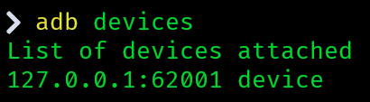
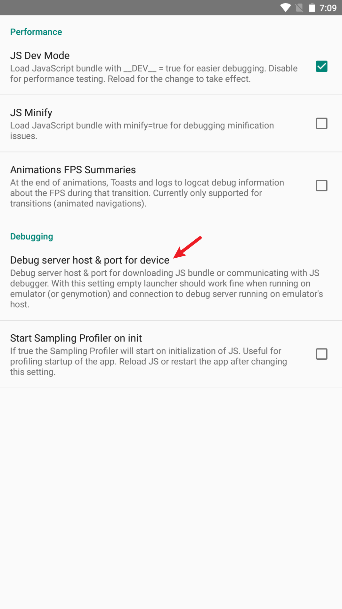
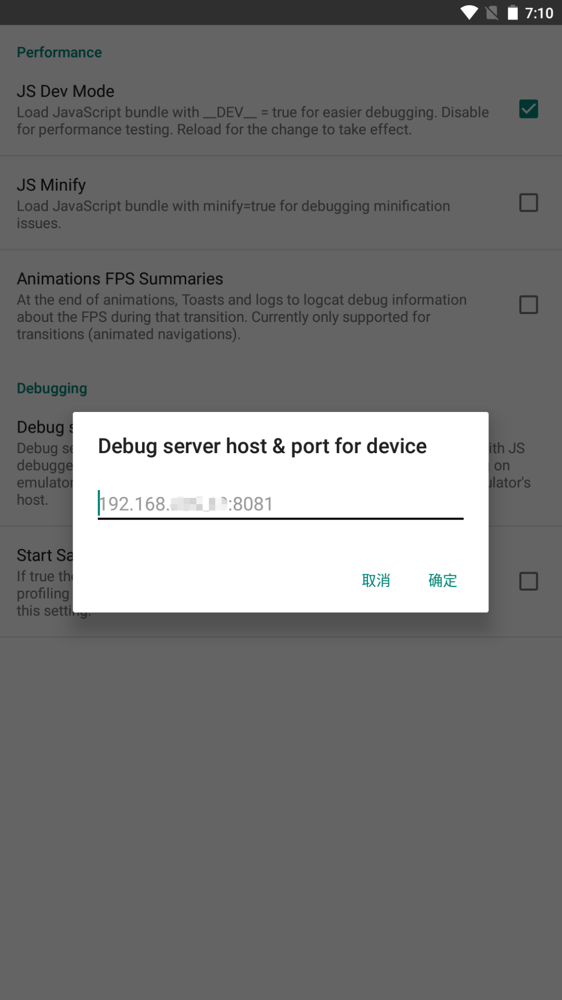

# 八字计算器

本项目主要用于计算生辰八字。

## 如何使用

### 安卓上调试

先连接手机，然后命令行中执行：

```shell
npm run android
```

#### 夜神模拟器中测试

首先需要执行 `adb connect 127.0.0.1:52001` （夜神模拟器端口默认是52001，需要自行查看模拟器设置的端口），以连接模拟器。

然后通过 `adb devices` 检查确认下是否连接上设备，如果连接上了那么此指令执行后会有如下显示：



确认连接完成后执行 `npm run android`，就会自动将 App 安装到模拟器中。


随后启动 APP，调出设置并点击下图按钮：



在弹出的输入框中输入 React Native 服务器地址即可：



配置好之后重启即可，如果不进行这个配置那么无法正常显示 APP 内容，只显示一个黑屏的报错界面。

### iOS 调试

```shell
npm run ios
```

## 相关工具

* React Native

## 参考

* [维基百科-八字](https://zh.wikipedia.org/zh-hk/%E5%85%AB%E5%AD%97)
* [window系统下如何在react native安卓开发中用夜神模拟器](https://www.yeshen.com/faqs/ByJvFeXeZ)
